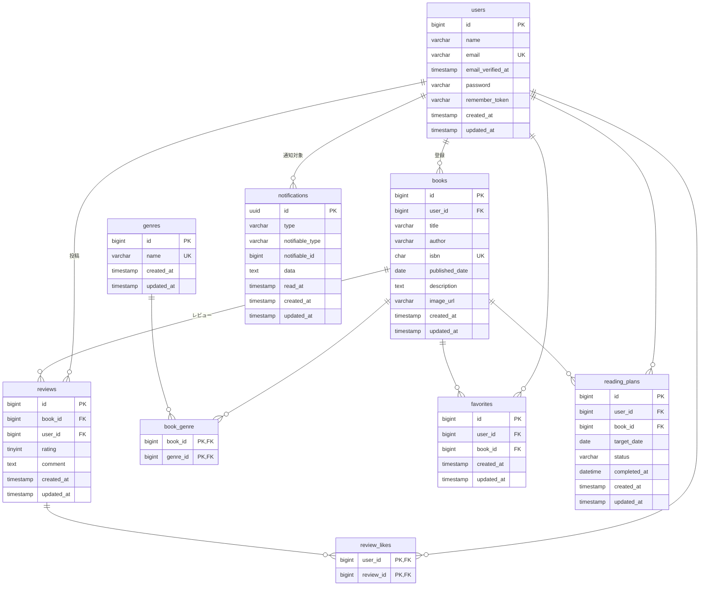

# BookShelf 書籍レビューアプリ

書籍を登録・閲覧し、レビューやお気に入り、レビューへのいいねを行える書籍レビューアプリケーションです。

ジャンルによる書籍分類、評価に基づくランキング、キーワード・ジャンル・並び順を組み合わせた検索、ISBN-13によるGoogle Books API連携、マイ読書レポート、読書計画、リマインダー通知などの機能を実装しています。

また、外部アプリケーションから利用できる公開REST APIを提供し、書き込み系エンドポイントにはLaravel Sanctumによるトークン認証を使用しています。

## 機能一覧

* ユーザー登録・ログイン・ログアウト
* 書籍のCRUD
* ジャンルのCRUD
* 書籍とジャンルの紐付け
* 書籍レビューのCRUD
* お気に入り登録・解除
* レビューへのいいね・解除
* 平均評価に基づくランキング
* キーワード・ジャンル・並び順による書籍検索
* ISBN-13によるGoogle Books API連携
* マイ読書レポート
* 読書計画のCRUD
* 読書計画の期日変更・読了処理
* 読書計画の期限切れ処理
* 期日3日前・当日・3日後のリマインダー通知
* 日次バッチによる読書計画の自動処理
* 通知一覧・既読処理
* 公開REST API（書籍CRUD）
* Laravel SanctumによるAPI認証・認可
* PHPUnitによる自動テスト

## 動作環境

- PHP 8.5
- MySQL 8.4
- Docker / Laravel Sail
- phpMyAdmin

## 使用技術

| 分類      | 技術                                |
| ------- | --------------------------------- |
| バックエンド  | PHP 8.5 / Laravel 10.x            |
| データベース  | MySQL 8.4                         |
| フロントエンド | Blade / Tailwind CSS / Vite       |
| 認証      | Laravel Fortify / Laravel Sanctum |
| API     | Laravel REST API / JSON           |
| 外部API   | Google Books API                  |
| 開発環境    | Docker / Laravel Sail             |
| DB管理    | phpMyAdmin                        |
| テスト     | PHPUnit                           |
| コード整形   | Laravel Pint                      |

## 環境構築手順

### 1. リポジトリをクローンする

```bash
git clone https://github.com/mitoyuu/bookshelf-app.git
cd bookshelf-app
```

### 2. `.env` ファイルを作成する

```bash
cp .env.example .env
```

`.env` のデータベース接続情報を確認します。

```dotenv
DB_CONNECTION=mysql
DB_HOST=mysql
DB_PORT=3306
DB_DATABASE=laravel
DB_USERNAME=sail
DB_PASSWORD=password
```

`DB_HOST` は `localhost` や `127.0.0.1` ではなく、Docker Composeで使用するMySQLコンテナ名の `mysql` を指定します。

### 3. Composerパッケージをインストールする

ローカル環境にComposerを用意していない場合は、Docker経由でインストールできます。

```bash
docker run --rm \
    -u "$(id -u):$(id -g)" \
    -v "$(pwd):/var/www/html" \
    -w /var/www/html \
    laravelsail/php82-composer:latest \
    composer install --ignore-platform-reqs
```

### 4. Laravel Sailを起動する

```bash
./vendor/bin/sail up -d
```

Sailのエイリアスを設定している場合は、以降のコマンドを `sail` として実行できます。

```bash
sail up -d
```

### 5. アプリケーションキーを生成する

```bash
sail artisan key:generate
```

### 6. データベースを構築する

マイグレーションとSeederを実行します。

```bash
sail artisan migrate --seed
```

データベースを初期状態から作り直す場合は、以下を使用します。

```bash
sail artisan migrate:fresh --seed
```

### 7. フロントエンドの依存パッケージをインストールする

```bash
sail npm install
```

### 8. Viteを起動する

```bash
sail npm run dev
```

開発中はVite開発サーバーを起動した状態で使用してください。

## 開発環境URL

* アプリケーション: [http://localhost/books](http://localhost/books)
* phpMyAdmin: [http://localhost:8080](http://localhost:8080)

## APIエンドポイント一覧

APIのベースURLは `/api/v1` です。

| メソッド        | パス                   | 認証        | 概要     |
| ----------- | -------------------- | --------- | ------ |
| GET         | `/api/v1/books`      | 不要        | 書籍一覧取得 |
| GET         | `/api/v1/books/{id}` | 不要        | 書籍詳細取得 |
| POST        | `/api/v1/books`      | Sanctum必須 | 書籍登録   |
| PUT / PATCH | `/api/v1/books/{id}` | Sanctum必須 | 書籍更新   |
| DELETE      | `/api/v1/books/{id}` | Sanctum必須 | 書籍削除   |

### APIの特徴

* JSON形式でレスポンスを返します。
* 書籍一覧では検索・絞り込み・ページネーションに対応しています。
* 書籍の登録・更新・削除にはLaravel Sanctumによるトークン認証が必要です。
* 書籍の更新・削除では、認証ユーザーが対象書籍の所有者であるかを認可します。

## テスト

すべての自動テストを実行します。

```bash
sail artisan test
```

カバレッジを確認する場合は以下を実行します。

```bash
sail artisan test --coverage
```

本プロジェクトでは応用機能を含めたテストを実装し、カバレッジ80%以上を目標としています。

## ER図



※ `notifications` はLaravelのポリモーフィックリレーションを使用しています。

※ `favorites` は `(user_id, book_id)` に複合UNIQUE制約があります。

※ `book_genre` と `review_likes` は複合主キーを使用しています。

## 作成者

住友優子
